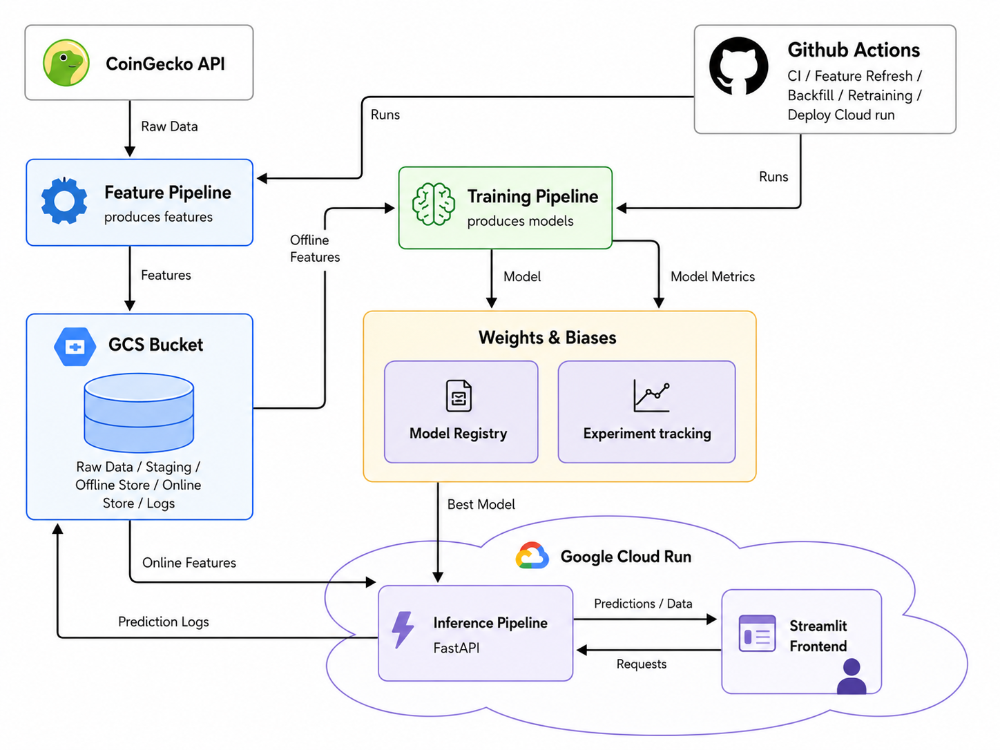

# Cryptocurrency Price Direction Prediction System

  

This project predicts whether a cryptocurrency price will move up or down over a 24-hour horizon using live CoinGecko market data.

- GitHub Actions automates feature refresh, historical backfills, model training, CI checks, and Cloud Run deployment.
- The feature pipeline writes raw, staging, offline, and online Parquet datasets to Google Cloud Storage.
- The training pipeline fits an XGBoost classifier and registers the production model in Weights & Biases.
- FastAPI loads the latest online features and production model, while Streamlit provides the user-facing prediction dashboard.
